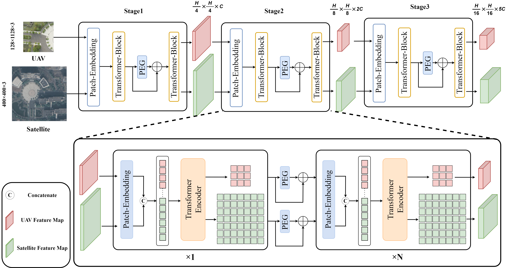

<h1 align="center"> OS-FPI: A Coarse-to-Fine One-Stream Network for UAV Geo-Localization and Navigation </h1>

This repository contains code for the paper titled [OS-FPI: A Coarse-to-Fine One-Stream Network for UAV Geo-Localization](https://ieeexplore.ieee.org/document/10478125).



## News
- **`2024/12/22`**: Our code are released.(Due to the author's extreme laziness, this is a very rough version)


## Prerequisites

- Python 3.7+
- GPU Memory >= 8G
- Numpy 1.26.0
- Pytorch 2.0.0+cu118
- Torchvision 0.15.0+cu118

## Installation

```
pip install -r requirments.txt
```

Create the directory for saving the training log and ckpts.

```
mkdir checkpoints
```

## Dataset

You can obtain the dataset from this [repository](https://github.com/Dmmm1997/DRL).

## Train & Evaluation

### Training and Testing

You could execute the following command to implement the entire process of training and testing.

```
bash train_test_local.sh
```

### Evaluation

The following code is used to test the performance of the model.

```
 tool/model_test_server.py
```

## Citation

The following paper uses and reports the result of the baseline model. You may cite it in your paper.

```bibtex
@article{drl,
  title={OS-FPI: A Coarse-to-Fine One-Stream Network for UAV Geo-Localization},
  author={Chen, Jiahao and Zheng, Enhui and Dai, Ming and Chen, Yifu and Lu, Yusheng},
  journal={IEEE Journal of Selected Topics in Applied Earth Observations and Remote Sensing},
  year={2024},
  publisher={IEEE}
}
```

## Related Work
- WAMF-FPI [https://www.mdpi.com/2072-4292/15/4/910](https://www.mdpi.com/2072-4292/15/4/910)
- DRL [https://github.com/Dmmm1997/DRL](https://github.com/Dmmm1997/DRL)
- DenseUAV [https://github.com/Dmmm1997/DenseUAV](https://github.com/Dmmm1997/DenseUAV)
- FSRA [https://github.com/Dmmm1997/FSRA](https://github.com/Dmmm1997/FSRA)
